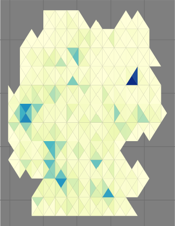
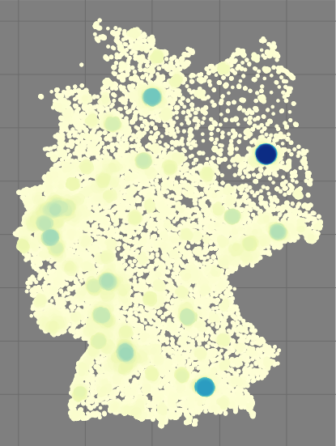

# FormizeR
R package for "Introduction to Programming with R". It easily lets you create 
visual overviews for point intensities with different shapes.

## Installation
For installing the FormizeR package, install the newest of the ``devtools`` or
``remotes`` package **and** `Rcpp >= 1.0.10`. Then go ahead with
```R
devtools/remotes::install_github("KonstiDE/FormizeR", dependencies = T)
library(FormizeR)

library(ggplot2)
library(raster)
library(sf)
library(rayshader)
library(rgl)
library(spatialrisk)
```

## Exemplary Usage
Using the FormizeR plugin is easy, as FormizeR directly provides you 
with exemplary data to test its potential and get familiar with
the styling options. Mandatory are a point layer and a shape layer (both provided inside the package) and the cellsize, 
determining the size of the form. The standard method with minimal parameters goes as follows:

```R
plot_intensity_standard(
    ger_points,              #provided by FormizeR
    ger_admin,               #provided by FormizeR
    cellsize = 0.3           #size of the form
)
```

This will plot the bakery-intensity of germany in hexagons, with a default
color scale of white to blue. However, to style your plot, FormizeR provides
you with a lot of parameters. Mandatory parameters are bold and cursive, not mandatory ones with their default
values are bold only:

> ***point_layer*** sf object: An sf object containing points.\
> ***shape_layer*** sf object: An sf object consisting of a polygon.\
> ***cellsize*** numeric: Size of the hexagons / rectangles.\
> **net** logical=TRUE\
> **net.border** logical=TRUE\
> **net.border.color** character='black'\
> **net.border.width** numeric=1\
> **plot** logical=TRUE\
> **plot.color** vector of characters=c("white", "blue")\
> **plot.scalename** character=''\
> **plot.theme** ggplot2-theme=theme_bw()\
> **plot.3d** logical=FALSE\
> **plot.3d.scale** numeric=100\
> **plot.3d.sunangle** numeric=360 
> **plot.3d.shadow_intensity** numeric=0.75 

Anyhow, one thinks that the parameters are not sufficient to create the plot
you are aiming for, you simply set ``plot=FALSE`` and save the dataframe returned
by the ``plot_intensity_[...]`` method and plot it yourself via the famous
``ggplot`` package. The resulting dataframe consists of a `geometry` and `intensity`
column containing the polygons and sums of the points for each form respectively. The following
snippet shows an example of how to plot the FormizeR result with a custom plot:

```R
df <- plot_intensity_standard(
    ger_points,
    ger_admin,
    cellsize = 0.4,
    plot=FALSE
)

ggplot(data = df$geometry, aes(fill=df$intensity)) + 
    geom_sf(color=NA) + 
    scale_fill_gradientn(colours = c("purple", "orange", "red"))
```

A list of all methods can be found below as FormizeR provides:
> plot_intensity_standard(...)\
> plot_intensity_fishernet(...)\
> plot_intensity_triangular_left(...)\
> plot_intensity_triangular_right(...)\
> plot_intensity_rectengular_fishernet(...)\
> plot_intensity_trakistile(...)\
> plot_intensity_rhombus(...)\
> plot_intensity_diamond(...)\
> plot_intensity_bubbles(...)

|                   ...standard(hex=TRUE)                    |                    ...standard(hex=FALSE)                    |                      ..._fishernet(...)                      |                      ..._triangle_left(...)                      |                      ..._triangle_right(...)                      |                 ..._rectengular_fishernet(...)                 |                    ..._trakistile(...)                    |                      ..._rhombus(...)                      |                      ..._diamond(...)                      |                      ..._bubbles(...)                      |
|:----------------------------------------------------------:|:------------------------------------------------------------:|:------------------------------------------------------------:|:----------------------------------------------------------------:|:-----------------------------------------------------------------:|:--------------------------------------------------------------:|:---------------------------------------------------------:|:----------------------------------------------------------:|:----------------------------------------------------------:|:----------------------------------------------------------:|
|  |  |  |  |  |  |  |  |  |  |


# 3D Plots
Creating a 3d plot of your intensity map with FormizeR is easy. Just set the plot and plot.3d both
to `TRUE`. This will result in a rgl window. Position it the way you like it and call `rgl.snapshot("snapshot.png")`
to save you beautiful 3d plot. We depict a minimal example for a 3d plot made with FormizeR
in the following snippet:

```R
plot_intensity_standard(
  ger_points,
  ger_admin,
  cellsize = 0.5,
  net.border = FALSE,
  plot.color = c("purple", "orange", "red"),
  plot.3d=TRUE,
)
rgl.snapshot("snapshot.png")
```
The output then can look somewhat like the following images:

| ..._standard(plot3d=TRUE) | ...fishernet(plot3d=TRUE) |
|:-------------------------:|:--------------------------|
|   |  |


# Roadmap

- [ ] More geometries and forms
- [ ] Basemap integration
- [ ] Full ggplot parameter passthrough
- [ ] Error handling messages providance


